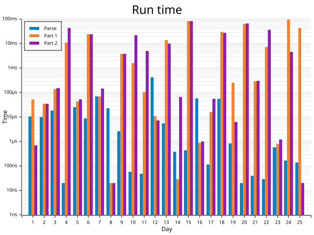

# Advent of Code in Rust

This will be the ultimate repository for my Advent of Code solutions in Rust and definitely the last I need. It is a workspace that contains all finished solutions, as well as a shared library for common utilities.

## Repository Structure

Key directories and files:

```
.
├── template            # Template for solutions
│   └── ...
├── util                # Shared library for common utilities
│   └── ...
└── yearXXXX            # A directory for each year of Advent of Code
    └── dayYY           # A directory for each day of the year
        ├── example.in  # Example input data
        ├── example.out # Expected output for the example
        ├── puzzle.in   # Puzzle input data
        └── src
            └── main.rs # Solution code for the day
```

> If you find the repository structure useful, feel free to use it as a template for your own solutions. See the [Onboarding guide](./ONBOARDING.md) for more details.

## License

This project is licensed under the MIT OR Apache-2.0 License. See the [LICENSE-MIT](LICENSE-MIT) and [LICENSE-APACHE](LICENSE-APACHE) files for details.

## 2015


